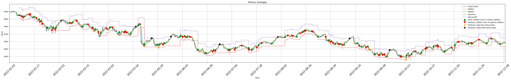
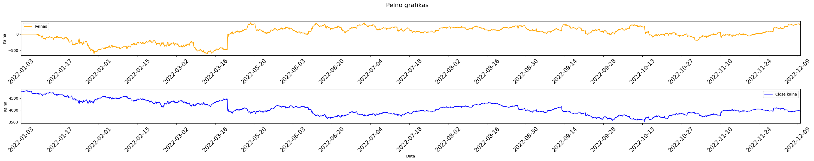
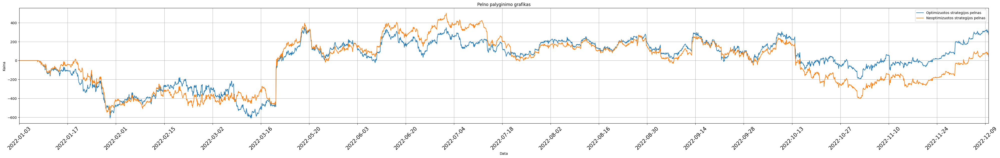

# Trading strategy backtesting program





## Table of Contents
- [About](#about)
- [Installation](#installation)
- [License](#license)

## About
This program employs a simple trading strategy that utilizes two DEMA indicators. 
It generates graphs showcasing at what points the user should buy, sell, and for what reason. Moreover, it shows profit graphs for both unoptimized and optimized versions. 
The optimization simply brute-forces different period combinations for the DEMA indicators and chooses the pair that yields the highest Sharpe ratio. 

## Installation
### Install
```bash
# clone the repo
git clone https://github.com/AinisALaur/Trading-strategy-backtesting.git
```
Simply run the strategy.ipynb with the needed .csv file containing various S&P500 historical data

## License
This project currently has no license assigned. All rights reserved until a license is chosen.
